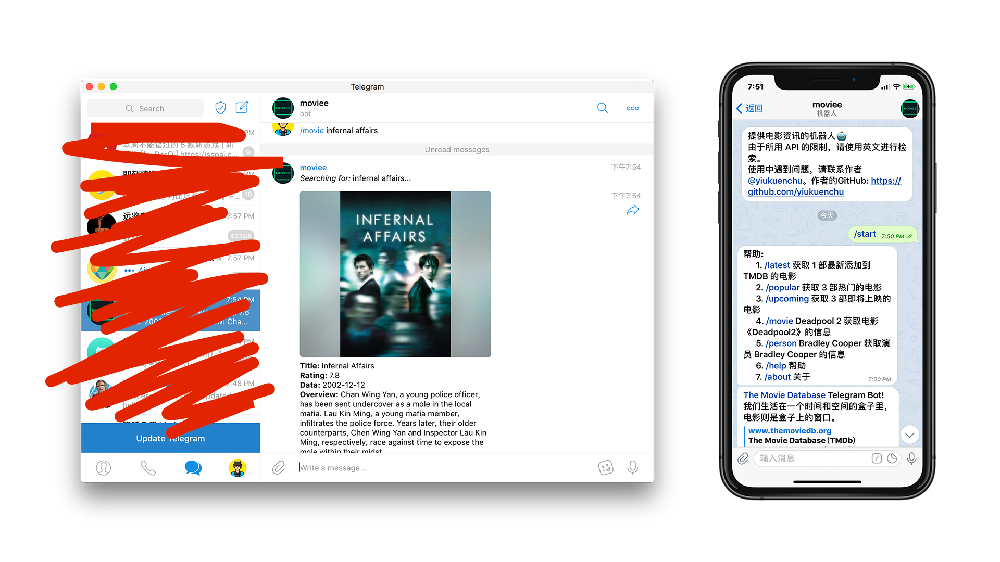
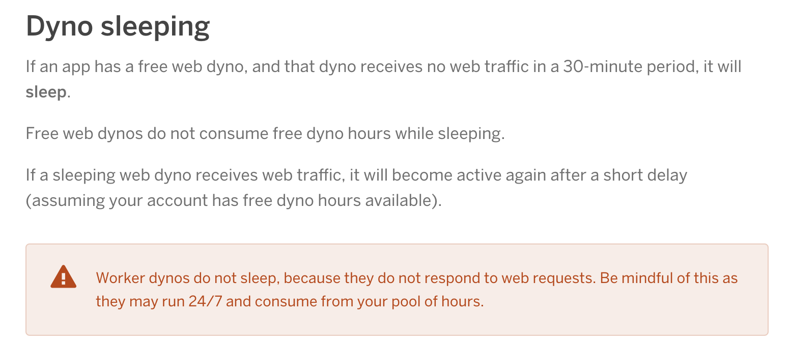

<div align=center>
    
</div>

<br>

# 简介

这是一个用于检索电影、演员以及获取电影资讯的 Telegram Bot。  

点击链接：https://t.me/moviee_info_bot 跳转到 Telegram 即可使用。

<div align=center>
    
</div>
<br>

如果你想基于本项目进行二次开发，请继续往下看
# 前期准备

1. 为了方便开发调试，在电脑上打开[ Telegram 官网 ](<https://telegram.org/>)，并下载桌面版本的 Telegram。

2.  [@BotFather](<https://telegram.me/BotFather>) 是一个用来管理所有 Bots 的 Telegram Bot。在里面用 ```/newbot``` 创建一个 Bot，记录下它返回的 **Token**。用这个 Token 填入 ```index.js``` 文件中提示的位置。

# 介绍我的开发过程

## 1. 引入模块

选择要引入的模块，当然随着开发过程一般会不断增加需要用到的模块。但一开始肯定要引入一个 Telegram Bot API。官方为制作 Telegram Bot 提供了多种多种语言的选择，每种语言又提供了多种 API。我选择了 Node.js，这里推荐一个使用起来较为简单的 [Node.js Telegram Bot API](<https://github.com/yagop/node-telegram-bot-api>)。我们在终端进入项目文件夹后，用 ```npm install node-telegram-bot-api ``` 就能引入这个模块啦。然后在代码中用这个模块创建一个 Bot 实体，比如：

```js
const TelegramBot = require('node-telegram-bot-api');
const bot = new TelegramBot(token, {polling: true});
```
  
这里 ```{polling: true}``` 是指我们用 polling 轮询的方式获取用户的指令。

## 2. 绑定 Bot

我们怎么样绑定我们创建的 Bot 呢？对的，就是在代码中引入上面的 Bot Token。比如说你的 Token 是 123456:abcdefghijk。那么在代码中：

```js
const token = '123456:abcdefghijk';
```

## 3. 开发功能

接下来就可以开发 Bot 的功能啦。如果你用的是上述第 1 步推荐的 API，那么极力推荐参考 [这个文档](<https://github.com/hosein2398/node-telegram-bot-api-tutorial>)，跟着里面的步骤实现一个简单的功能。比如：

```js
bot.onText(/\/start/, (msg) => {

bot.sendMessage(msg.chat.id, "Welcome");
    
});
```
  
上面代码实现的效果是，当用户对 Bot 发送 ```/start``` 消息时，Bot 就会回复一句 Welcome。  

类似地，通过 ```bot.sendPhoto``` 可以让 Bot 发送一张图片。Bot 的许多其他行为都包含在这个 API 中，发挥想象便可以实现一些有趣的功能。


## 4. 部署上线

此时，在调试的过程中我发现 Bot 是无法对用户的指令作出回应的，因为它还没有连接到 Bot Server。因此这个项目中我在开发过程中便将项目部署在服务器上，这里我选择了部署在 [Heroku](<https://www.heroku.com/>)。  

但紧接着，我发现了一个问题，服务开启一段时间后， Bot 便不再对指令作出回应。我在后台查看服务的 Logs 并根据 Heroku 官方文档找到了原因： Heroku 的免费账号限制服务如果一段时间内没有动作，便会自动进入休眠状态。

<div align=center>
    
</div>

为了避免这种情况，我用 [express](<https://www.npmjs.com/package/express>) 的服务让服务器持续监听一个端口，使得这个服务器无法进入休眠状态。因此我们用 ```npm install express``` 安装 expresss 模块，接着在代码中：

```js
//引入 express
const express = require('express');
const app = express();
// 监听端口
const port = process.env.PORT;
app.listen(port);
```
  
这样，就能让你的 Telegram Bot 24/7 不停工作啦。

# 其他说明

1. 我做的这个 Telegram Bot 的电影数据来源 [TMDb](<https://www.themoviedb.org/>)，如果你感兴趣，可以注册登录后在 [TMDb API](<https://www.themoviedb.org/settings/api>) 页面生成一个 API Key，根据 TMDb API 官方文档在你的项目中使用这项服务。  

2. 在解决服务自动休眠的问题时，我发现了 [Kaffeine](<http://kaffeine.herokuapp.com/>)。这是一个解决 Heroku 免费账户限制服务器休眠问题的项目，它的思路是每隔一段时间 ping 你的服务 URL。类似的项目还有 [UptimeRobot](<https://uptimerobot.com/>) 等。但这些毕竟是第三方服务，安全问题值得考虑。  

3. Heroku 免费账户如果绑定了信用卡，可以通过添加 [New Relic](<https://elements.heroku.com/addons/newrelic>) 这个 add-on，避免服务器自动休眠。

# 感想

本文列出了制作一个 24/7 Telegram Bot 的大体过程。虽然 Telegram 在国内的用户只是很小一部分，但它本身的可发掘性是摆在那里的。对于编程感兴趣的小伙伴不妨以 Telegram Bot 作为起点开始学习。而对于普通用户来说，如果能在这个过程中养成「遇到问题，查找文档，解决问题」的思维方式，也是收获了巨大的精神宝藏。

# License

MIT